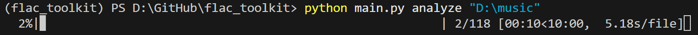
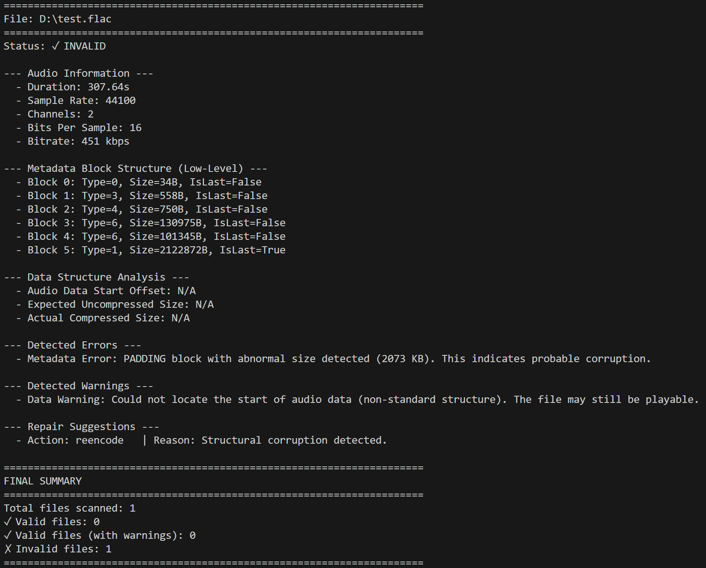

# FLAC Toolkit

A command-line tool for the analysis and repair of FLAC audio files. This tool is designed to identify issues from simple metadata inconsistencies to low-level structural corruption.

## Key Features

* **Comprehensive Analysis:** Uses both `mutagen` library and manual header parsing to detect FLAC file issues.
* **Interactive HTML Reporting:** Generates an HTML report with sorting, filtering, and copy-to-clipboard functionality.
* **Structural Analysis:** Detects common corruption indicators like oversized PADDING blocks.
* **Data Structure Check:** Identifies data inconsistencies that may indicate file corruption.
* **Universal Filename Validation:** Checks for invalid filenames using a strict, universal ruleset. The generated report includes detailed reasons for any validation failures.
* **Automated Re-encoding (`repair` mode):**
  * **Identifies and re-encodes** files with structural errors to produce a valid version.
  * Quarantines original files in a `_flac_toolkit_quarantine` folder.
  * Preserves original filenames for repaired files.
  * Falls back to `ffmpeg` if `flac` is not available.
* **ReplayGain Calculation:** Applies track and album ReplayGain tags based on the EBU R 128 standard (-18 LUFS).
* **Duplicate Detection (`dedupe` mode):**
  * Scans audio MD5 signatures to find files with identical audio content.
  * Distinguishes **strict duplicates** (byte-for-byte identical) from **audio-only duplicates** (same audio, different metadata).
  * Helps clean up libraries with multiple copies of the same tracks.
* **Status Classification:** Classifies files as `VALID`, `VALID (with warnings)`, or `INVALID`.

## Prerequisites

* Python 3.12+
* Required Python packages: `mutagen`, `unidecode`, `pyloudnorm`, `soundfile`, `numpy`, `pandas`, `tqdm`, `pathvalidate`.
* **For Repair Only:** `flac` command-line tool and/or `ffmpeg` installed and available in your system's PATH. (Analysis is now fully standalone).

## Installation

1. Clone the repository.
2. Install the required Python packages (e.g., using pip or uv):

   ```bash
   pip install -r requirements.txt 
   # or if using uv
   uv sync
   ```

3. Ensure `flac` and/or `ffmpeg` are installed if you intend to use the `repair` mode.

## Usage

The script is run from the command line with the following structure:

```bash
python main.py [mode] [options] [TARGET_PATHS]...
```



### Modes

* `analyze`: Performs a detailed analysis of target files.
  * Generates an interactive **HTML Report** (`flac_analysis_report.html`) by default.
  * Displays a summary in the console.
* `repair`: Analyzes files and **re-encodes** any that are structurally invalid.
  * **Quarantine:** Original files are moved to a `_flac_toolkit_quarantine` subfolder.
  * **Seamless Replacement:** The repaired file replaces the original with the same name.
  * Use `--force` to re-encode all target files, regardless of their status.
* `replaygain`: Calculates and applies ReplayGain tags (both track and album) to the target files.
* `dedupe`: Scans for duplicate files based on audio content.
  * Generates an interactive **HTML Report** (`flac_duplicate_report.html`) by default.
  * **Audio-Only Duplicates:** Files with identical audio but different metadata or filenames.
  * **Strict Duplicates:** Files that are byte-for-byte identical.

### Options

* `--output`, `-o`: Used with `analyze` and `dedupe` modes. Specify the output path for the HTML report.
* `--force`: Used with `repair` mode. Forces re-encoding of all files, even if they are valid.
* `--assume-album`: Used with `replaygain` mode. Treats all processed files as a single album for ReplayGain calculation.
* `-w`, `--workers`: Number of parallel workers for faster processing.
* `-v`, `--verbose`: Enables detailed debug output.
* `-q`, `--quiet`: Suppresses all informational output, showing only errors.

### Examples

* **Analyze a single file:**

  ```bash
  python main.py analyze path/to/my_song.flac
  ```

* **Analyze all FLAC files in a directory (recursive):**

  ```bash
  python main.py analyze path/to/my_music/
  ```

* **Automatically repair all problematic files in a directory:**

  ```bash
  python main.py repair path/to/my_library/
  ```

* **Force re-encoding on a selection of files:**

  ```bash
  python main.py repair --force file1.flac another_file.flac
  ```

* **Apply ReplayGain to an album directory:**

  ```bash
  python main.py replaygain path/to/an_album/
  ```

* **Find duplicate files in your library:**

  ```bash
  python main.py dedupe path/to/my_library/
  ```

## Understanding the `analyze` Output

The analysis report for each file includes the following sections:



Example screenshot showing the detailed analysis output for a FLAC file.

* **Status:** Overall file validity assessment.
* **Audio Information:** Basic metadata like duration, sample rate, and channels.
* **Metadata Block Structure:** Technical view of the file's internal metadata structure.
* **Data Structure Analysis:** Information about audio data location and size.
* **Detected Errors / Warnings:** List of identified problems.
* **Repair Suggestions:** Recommended actions to fix detected issues.
