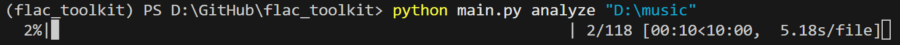
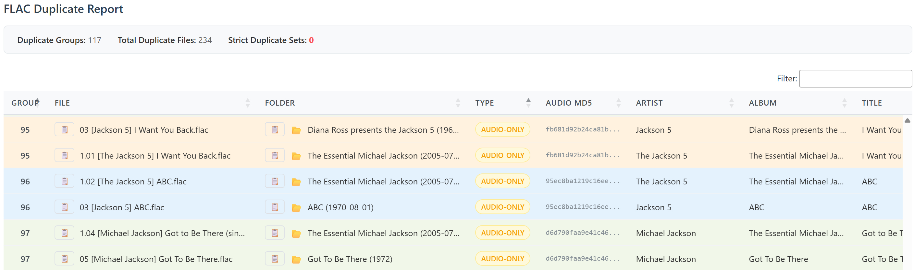
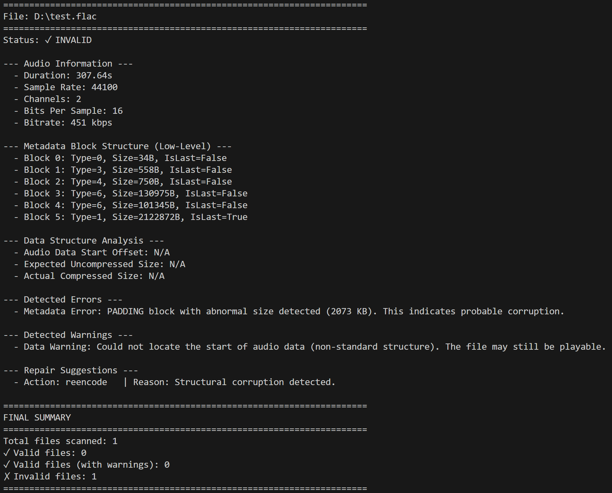

# FLAC Toolkit

A command-line tool for the analysis and repair of FLAC audio files. This tool can :
* identify issues from invalid filenames, metadata inconsistencies, to low-level structural corruption,
* repair corrupted FLAC files,
* calculate and apply album and track ReplayGain tags,
* detect duplicate tracks, based on audio information.

## Key Features

* **Comprehensive Validation:** Uses RFC 9639 binary parsing including STREAMINFO, metadata blocks, first-frame CRC-8 verification, and audio MD5 checksum to rigorously validate FLAC files.
* **Interactive HTML Reporting:** Generates an HTML report with sorting, filtering, and copy-to-clipboard functionality.
* **Machine-Readable JSON Export:** Every `validate` run also produces a `.json` data file containing all results. This file can be used to regenerate the HTML report without re-scanning (via `report` command), or consumed by external tools and scripts.
* **Structural Analysis:** Detects common corruption indicators like oversized PADDING blocks.
* **Data Structure Check:** Identifies data inconsistencies that may indicate file corruption.
* **Universal Filename Validation:** Checks for invalid filenames using a strict, universal ruleset. The generated report includes detailed reasons for any validation failures.
* **Automated Re-encoding (`repair` mode):**
  * **Identifies and re-encodes** files with structural errors to produce a valid version.
  * Quarantines original files in a `_flac_toolkit_quarantine` folder (or deletes originals with `--no-backup`).
  * Preserves original filenames for repaired files.
  * Uses the native `flac` encoder (significantly faster than ffmpeg), with fallback to `ffmpeg` if unavailable.
* **ReplayGain Calculation:** Applies track and album ReplayGain tags based on the EBU R 128 standard (-18 LUFS).
* **Duplicate Detection (`--check-duplicates` in `validate`):**
  * Scans audio MD5 signatures to find files with identical audio content.
  * Distinguishes **strict duplicates** (byte-for-byte identical) from **audio-only duplicates** (same audio, different metadata).
  * Reuses the MD5 signatures already computed during validation — no extra I/O — and adds a **Duplicates** tab directly in the validation report.
  * Helps clean up libraries with multiple copies of the same tracks.
* **Status Classification:** Classifies files as `VALID`, `VALID (with warnings)`, or `INVALID`.

## Prerequisites

* Python 3.12+
* Required Python packages: `mutagen`, `unidecode`, `pyloudnorm`, `soundfile`, `numpy`, `pandas`, `rich`, `pathvalidate`.
* **For Repair Only:** `flac` command-line tool and/or `ffmpeg` installed and available in your system's PATH. (Analysis is now fully standalone).

## Installation

1. Clone the repository.
2. Install the required Python packages (e.g., using uv):

   ```bash
   uv sync
   ```

3. Ensure `flac` and/or `ffmpeg` are installed if you intend to use the `repair` mode.

## Usage

The script is run from the command line with the following structure:

```bash
python main.py [mode] [options] [TARGET_PATHS]...
```



### Modes

* `validate`: Validates target files against RFC 9639 and generates an HTML report.
  * Generates an interactive **HTML Report** (default: `flac_validation_report_<target>.html`).
  * Displays a summary in the console.
  * Use `--check-duplicates` to also detect audio duplicates and include a **Duplicates** tab in the same report (no extra I/O — MD5s are reused from validation).
* `repair`: Analyzes files and **re-encodes** any that are structurally invalid.
  * **Quarantine:** Original files are moved to a `_flac_toolkit_quarantine` subfolder (or deleted with `--no-backup`).
  * **Seamless Replacement:** The repaired file replaces the original with the same name.
  * Use `--force` to re-encode all target files, regardless of their status.
* `report`: Regenerates an HTML report from a previously saved `.json` data file (no re-scan required). Useful to refresh the report after a template update, or to share/archive results separately from the HTML.

* `replaygain`: Calculates and applies ReplayGain tags (both track and album) to the target files.

### Options

* `--output`, `-o`: Used with `validate` and `report` modes. Specify the output path for the HTML report.
* `--check-duplicates`: Used with `validate` mode. Detects audio duplicates by grouping files that share the same audio MD5 (already computed during validation — zero extra I/O). Adds a **Duplicates** tab to the validation HTML report showing audio-only and strict duplicate groups.
* `--force`: Used with `repair` mode. Forces re-encoding of all files, even if they are valid.
* `--no-backup`: Used with `repair` mode. Deletes original files instead of quarantining them (saves disk space).
* `--assume-album`: Used with `replaygain` mode. Treats all processed files as a single album for ReplayGain calculation.
* `-w`, `--workers`: Number of parallel workers for faster processing (available in `validate` and `repair` modes).
* `-v`, `--verbose`: Enables detailed debug output.
* `-q`, `--quiet`: Suppresses all informational output, showing only errors.

### Examples

* **Validate a single file:**

  ```bash
  python main.py validate path/to/my_song.flac
  ```

* **Validate all FLAC files in a directory (recursive):**

  ```bash
  python main.py validate path/to/my_music/
  ```

* **Automatically repair all problematic files in a directory:**

  ```bash
  python main.py repair path/to/my_library/
  ```

* **Force re-encoding on a selection of files:**

  ```bash
  python main.py repair --force file1.flac another_file.flac
  ```

* **Apply ReplayGain to an album directory:**

  ```bash
  python main.py replaygain path/to/an_album/
  ```

* **Validate and check for duplicates in one pass:**

  ```bash
  python main.py validate --check-duplicates path/to/my_library/
  ```

* **Regenerate an HTML report from saved JSON data (no re-scan):**

  ```bash
  python main.py report flac_validation_report_my_library.json
  ```

* **Regenerate with a custom output name:**

  ```bash
  python main.py report data.json -o my_report.html
  ```

* **Find duplicate files in your library (standalone):**

  ```bash
  python main.py dedupe path/to/my_library/
  ```



## Understanding the `validate` Output

The HTML report for each file includes the following sections:



* **Status:** Overall file validity assessment (`VALID`, `VALID (with warnings)`, or `INVALID`).
* **Audio Information:** Basic metadata like duration, sample rate, and channels.
* **Metadata Block Structure:** Technical view of the file's internal metadata structure.
* **MD5 Verification:** Header MD5 compared against the calculated MD5 of the audio data.
* **Validation Results:** Errors, warnings, and informational notes with RFC 9639 references.
* **Tags:** Vorbis comment tags including ReplayGain values when present.

When `--check-duplicates` is used, the report gains a second **Duplicates** tab listing all files that share the same audio content, grouped by audio MD5 and classified as **Audio-Only** or **Strict** (byte-for-byte identical) duplicates.
